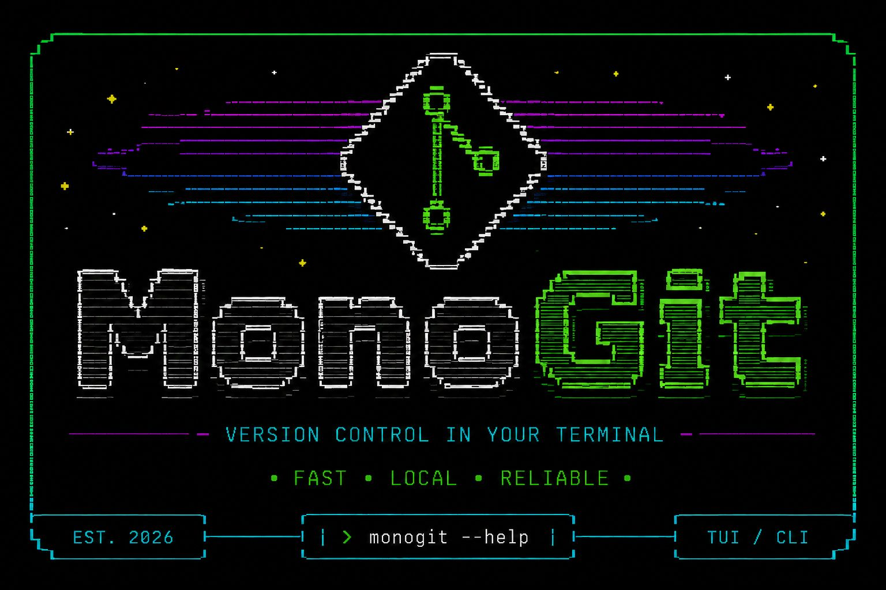

# monogit

<p align="center">
  <a href="https://github.com/JoaoOliveira889/monogit/releases/latest"></a>
  <a href="https://github.com/JoaoOliveira889/monogit/releases/latest"></a>
  <a href="https://goreportcard.com/report/github.com/JoaoOliveira889/monogit"></a>
  <a href="https://github.com/JoaoOliveira889/homebrew-tap"></a>
</p>

<p align="center">
  <a href="https://github.com/JoaoOliveira889/monogit"><strong>MonoGit v0.2.0 · JoaoOliveira889/monogit</strong></a>
</p>

**Multi-repo Git dashboard for your terminal.** A TUI tool that scans a root directory for Git repositories and gives you a panoramic view of branches, ahead/behind status, and dirty state - with one-key actions for Git workflows and confirmation guards for every mutating command.



Built with [Bubble Tea](https://github.com/charmbracelet/bubbletea), [Lip Gloss](https://github.com/charmbracelet/lipgloss), and [Bubbles](https://github.com/charmbracelet/bubbles).

---

## Documentation

For detailed guides, configuration options, and troubleshooting, visit our **[Wiki Documentation](docs/README.md)**.

- [Getting Started](docs/getting-started.md)
- [Keybindings Reference](docs/keybindings.md)
- [Configuration Guide](docs/configuration.md)
- [Troubleshooting](docs/troubleshooting.md)

## Features

- **Panoramic Dashboard**: View multiple Git repositories at once with real-time indicators for branch name, ahead/behind status, and dirty state. The active branch is displayed directly alongside the repository name.
- **Repository Health Signals**: Surface detached HEAD, missing upstream, merge conflicts, stale branches, and local tags that still need to be pushed, directly in the repository panel and detail view.
- **Auto-scan & Detection**: Automatically discovers all Git repositories under any target root directory.
- **Batch Operations**: One-key actions to `fetch`, `pull`, and `push` either for the selected repository or for all of them concurrently. Bulk `checkout` and `stash` actions work across all filtered repositories with confirmation safeguards.
- **Confirmation Safeguards**: Mandatory confirmation dialogs for every mutating action that changes repository state or files, including pull, push, stash, commit, branch changes, tag creation, discard, and undo. Fetch stays direct, and commit wizard file selection stays local until the final commit confirmation.
- **Interactive Commit Wizard**: A guided flow to choose all changes or a manual file set, write a commit message, and optionally push changes in one go, with final confirmation before the commit runs.
- **Deploy Tags**: Create annotated tags and deploy them to remote repositories with a simple interactive wizard (shortcut `t`).
- **Branch Management**: List, create, checkout, merge, and delete both local and remote branches directly from the TUI.
- **External Integration**: Instantly open any repository in your favorite **Editor** (VS Code, Cursor, Zed, Vim, etc.) or **Browser** (GitHub, GitLab, etc.).
- **Stash Support**: Full stash management panel with pop, apply, drop, and file inspection.
- **Commit History & Graphs**: Toggle between a simple commit log and a visual commit graph.
- **Security First**: Built with Go's `exec.Command` with individual arguments to ensure zero shell injection vectors, no telemetry, and restrictive local config permissions.
- **Command Log**: A dedicated panel to inspect a temporary in-memory history and raw output of every executed Git command.
- **Tokyo Night Theme**: A beautiful, dark theme crafted with Lip Gloss for maximum readability.

---

## Installation

### Option 1 — Homebrew (macOS & Linux)

```bash
brew tap JoaoOliveira889/tap
brew install monogit
```

### Option 2 — Pre-built binary

Download the latest release for your platform from the [Releases page](https://github.com/JoaoOliveira889/monogit/releases/latest).

```bash
# macOS (Apple Silicon)
curl -LO https://github.com/JoaoOliveira889/monogit/releases/latest/download/monogit_Darwin_arm64.tar.gz
tar -xzf monogit_Darwin_arm64.tar.gz
sudo mv monogit /usr/local/bin/

# macOS (Intel)
curl -LO https://github.com/JoaoOliveira889/monogit/releases/latest/download/monogit_Darwin_x86_64.tar.gz
tar -xzf monogit_Darwin_x86_64.tar.gz
sudo mv monogit /usr/local/bin/

# Linux (amd64)
curl -LO https://github.com/JoaoOliveira889/monogit/releases/latest/download/monogit_Linux_x86_64.tar.gz
tar -xzf monogit_Linux_x86_64.tar.gz
sudo mv monogit /usr/local/bin/
```

### Option 3 — Install with `go install`

```bash
go install github.com/JoaoOliveira889/monogit/cmd/monogit@latest
```

> Requires Go 1.26.3 or later.

### Option 4 — Build from source

```bash
git clone https://github.com/JoaoOliveira889/monogit.git
cd monogit
go build -o monogit ./cmd/monogit
```

---

## Usage

```bash
# Scan current directory
monogit

# Scan a specific directory
monogit --path ~/projects

# Set auto-fetch interval to 10 minutes
monogit --interval 10m
```

### Flags

| Flag         | Default | Description                                |
|--------------|---------|--------------------------------------------|
| `--path`     | `.`     | Root directory to scan for Git repositories |
| `--interval` | `5m`    | Auto-fetch interval (e.g. `1m`, `10m`, `1h`) |
| `--version`  | -       | Show version, commit, and build date       |

Every mutating command opens a confirmation modal before it runs. Fetch stays direct, while pull, push, stash, undo, branch changes, tag creation, and the final commit confirmation follow that rule.

---

## Keybindings

### Global

| Key | Action |
|-----|--------|
| `↑ | k` | Move cursor up |
| `↓ | j` | Move cursor down |
| `← | h` | Switch to Left Panel (Repositories) |
| `→ | l` | Switch to Right Panel (Details/Log) |
| `1 | 2 | 3` | Jump directly to specific panel |
| `tab` | Cycle between visible panels |
| `ctrl+p | ?` | Toggle Help Menu |
| `esc` | Back / Cancel / Close |
| `q` | Quit |

### Repository Panel

| Key | Action |
|-----|--------|
| `f` | Fetch selected repository |
| `F` | Fetch **all** repositories |
| `p` | Pull selected repository |
| `P` | Pull **all** repositories |
| `u` | Push selected repository |
| `U` | Push **all** repositories |
| `c` | **Commit Wizard** (`a` add all, `v` select files → message → confirm → optional push) |
| `b` | List local & remote branches |
| `M` | Merge branch into HEAD (inside branch panel) |
| `t` | **Deploy Tag** (create → message → confirm → push) |
| `s` | **Stash** changes |
| `S` | Open **Stash Panel** (pop, apply, drop) |
| `Z` | **Stash All** (stash dirty filtered repos) |
| `B` | **Checkout All** (switch branch in all filtered repos) |
| `z` | **Quick Undo** (soft reset last commit) |
| `e` | Open in **Editor** (auto-detects VS Code, Vim, etc.) |
| `w` | Open in **Browser** (GitHub, GitLab, etc.) |
| `g` | Toggle Graph / Simple log view |
| `o` | Open Command Log |
| `v` | Start a selection range |
| `y` | Copy the current selection |
| `ctrl+v` | Paste clipboard text into prompts |

Mutating actions prompt for confirmation before they run, with fetch as the explicit exception.

Inside branch, file, stash, and commit panels, destructive actions continue to require confirmation before execution. Commit wizard file selection remains a local choice until the commit is confirmed.

The footer always keeps `? help` visible and shows the running `MonoGit` version on the right edge so global shortcuts and build context stay available in every screen.

---

## Layout

```
┌─────────────────────────┬──────────────────────────────┐
│  Repositories           │  ◈ api-gateway               │
│                         │                              │
│  ▸ api-gateway  main ↑2 │  Branch:  main               │
│    auth-svc     dev  ↓1 │  Ahead:   ↑ 2 commits       │
│    payment      main ✓  │  Behind:  0                  │
│    user-svc     feat ●  │  Status:  Modified ●         │
│                         │                              │
│                         │  Recent Commits:             │
│                         │  ─────────────────           │
│                         │  a1b2c3d Fix auth            │
│                         │  d4e5f6a Add rate limit      │
│                         │  g7h8i9j Update deps         │
└─────────────────────────┴──────────────────────────────┘
 f fetch │ p pull │ u push │ c commit │ t tag │ B checkout-all │ Z stash-all │ e editor │ q quit
```

---

## Architecture

The project follows **Clean Architecture** principles, keeping business logic decoupled from implementation details:

```
monogit/
├── cmd/monogit/        # Entry point
├── internal/
│   ├── domain/         # Core entities: Repository, FileStatus, interfaces
│   ├── usecase/        # Business logic: Git operations orchestrator
│   ├── adapters/
│   │   ├── git/        # CLI Git provider (exec-based, no shell injection)
│   │   └── tui/        # Bubble Tea UI: model, update, view, keys
│   └── pkg/
│       ├── scanner/    # Directory traversal and repo detection
│       ├── config/     # Local config and startup cache
│       ├── editor/     # Editor auto-detection and launcher
│       └── ui/         # Shared styles (Lip Gloss tokens)
└── .goreleaser.yaml    # Multi-platform release config
```

**Security note:** All Git commands are built using `exec.Command` with individual string arguments - no shell interpolation, no injection vectors, no telemetry, and no hidden data collection.

---

## Contributing

Contributions are welcome! Please read [CONTRIBUTING.md](CONTRIBUTING.md) before opening a pull request.

1. Fork the repository
2. Create a feature branch: `git checkout -b feat/my-feature`
3. Commit your changes following [Conventional Commits](https://www.conventionalcommits.org/)
4. Push and open a Pull Request

---

## Support

If monogit helps you manage repositories more efficiently, consider supporting its development.

<a href="https://www.buymeacoffee.com/JoaoOliveira889" target="_blank"></a>

---

## License

[MIT](LICENSE) © João Oliveira
