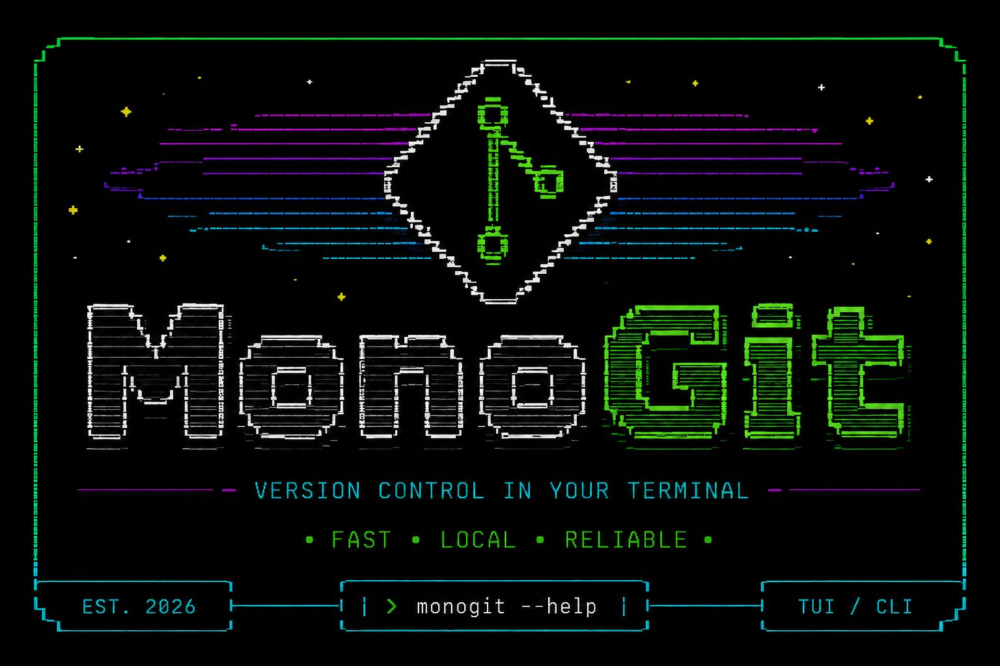
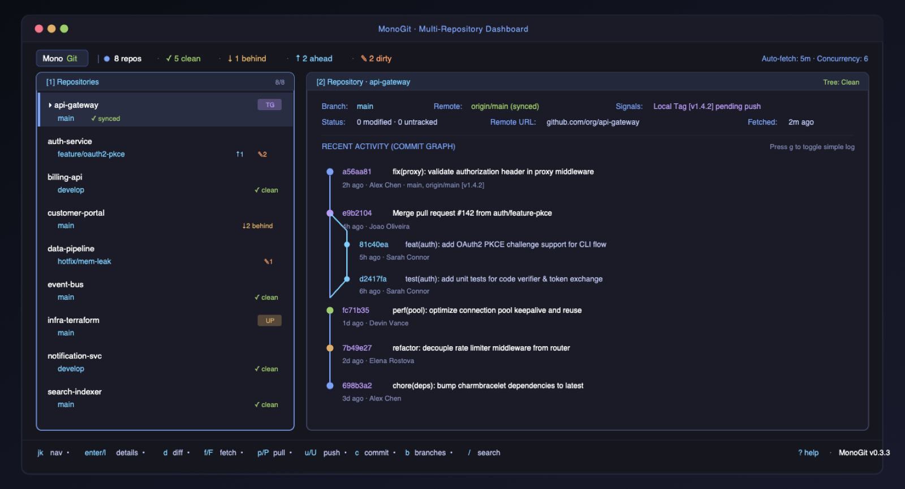
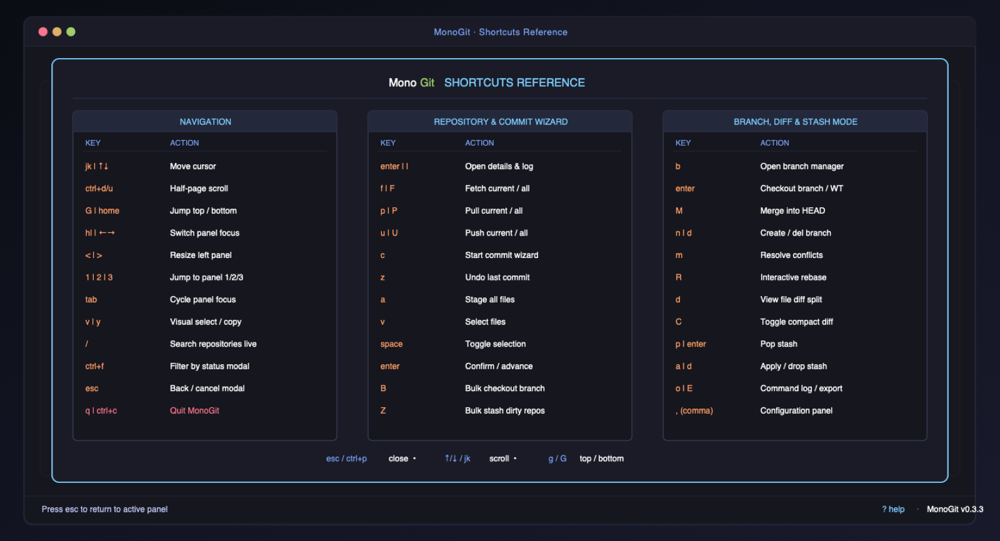
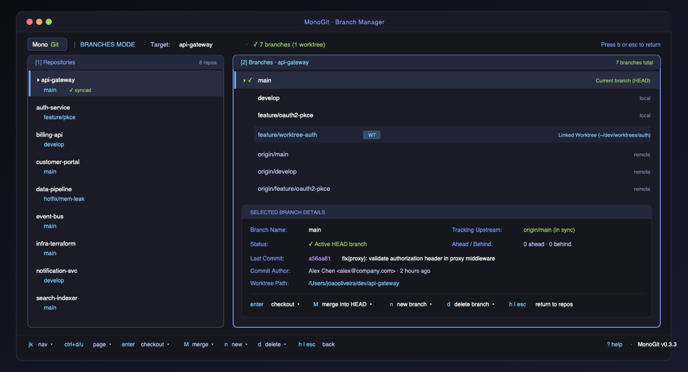

# monogit

<p align="center">
  <a href="https://github.com/JoaoOliveira889/monogit/releases/latest"></a>
  <a href="https://github.com/JoaoOliveira889/monogit/releases/latest"></a>
  <a href="https://goreportcard.com/report/github.com/JoaoOliveira889/monogit"></a>
  <a href="https://github.com/JoaoOliveira889/homebrew-tap"></a>
</p>

<p align="center">
  <a href="https://github.com/JoaoOliveira889/monogit"><strong>MonoGit v0.4.0 · JoaoOliveira889/monogit</strong></a>
</p>

**Multi-repo Git dashboard for your terminal.** A TUI tool that scans a root directory for Git repositories and gives you a panoramic view of branches, ahead/behind status, and dirty state - with one-key actions for Git workflows and confirmation guards for every mutating command.



Built with [Bubble Tea](https://github.com/charmbracelet/bubbletea), [Lip Gloss](https://github.com/charmbracelet/lipgloss), and [Bubbles](https://github.com/charmbracelet/bubbles).

---

## Documentation

For detailed guides, configuration options, and troubleshooting, visit our **[Wiki Documentation](docs/README.md)**.

- [Getting Started](docs/getting-started.md)
- [Keybindings Reference](docs/keybindings.md)
- [Configuration Guide](docs/configuration.md)
- [Troubleshooting](docs/troubleshooting.md)
- [v0.4.0 Release Notes](docs/releases/v0.4.0.md)
- [v0.3.5 Release Notes](docs/releases/v0.3.5.md)
- [v0.3.4 Release Notes](docs/releases/v0.3.4.md)
## 📸 Screenshots

### Multi-Repository Dashboard
Panoramic view of all Git repositories in your workspace with real-time branch status, dirty indicators, and commit graph:


### Table-Structured Shortcuts Reference
Quickly look up all global and contextual keybindings with clean column alignment and categorization:


### Branch & Worktree Management
Effortlessly browse local and remote branches, track worktree paths, and perform branch operations:


## Features

- **Adaptive Workspace**: View multiple Git repositories at once with real-time indicators for branch name, ahead/behind status, and dirty state. The desktop dashboard defaults to a compact repository rail and a wider activity workspace; files and diffs become side-by-side on wide terminals.
- **Repository Health Signals**: Surface detached HEAD, missing upstream, merge conflicts, stale branches, and local tags that still need to be pushed, directly in the repository panel and detail view.
- **Auto-scan & Detection**: Automatically discovers all Git repositories under any target root directory.
- **Batch Operations**: One-key actions to `fetch`, `pull`, and `push` either for the selected repository or for all of them concurrently. Bulk `checkout` and `stash` actions work across all filtered repositories with confirmation safeguards.
- **Confirmation Safeguards**: Mandatory confirmation dialogs for every mutating action that changes repository state or files, including pull, push, stash, commit, branch changes, tag creation, discard, and undo. Fetch stays direct, and commit wizard file selection stays local until the final commit confirmation.
- **Interactive Commit Wizard**: A guided flow to choose all changes or a manual file set, write a commit message, and optionally push changes in one go, with final confirmation before the commit runs.
- **Deploy Tags**: Create annotated tags and deploy them to remote repositories with a simple interactive wizard (shortcut `t`).
- **Branch & Worktree Management**: List, create, checkout, merge, and delete branches. Spot branches checked out in other worktrees via the cyan highlight and `WT` badge. Press `enter` on a worktree branch to open a new terminal at that path, or `d` to remove the worktree and delete the branch atomically.
- **External Integration**: Instantly open any repository in your favorite **Editor** (VS Code, Cursor, Zed, Vim, etc.) or **Browser** (GitHub, GitLab, etc.).
- **Stash Support**: Full stash management panel with pop, apply, drop, and file inspection.
- **Commit History & Graphs**: Toggle between a simple commit log and a visual commit graph.
- **Security First**: Built with Go's `exec.Command` with individual arguments to ensure zero shell injection vectors, no telemetry, and restrictive local config permissions.
- **Command Log**: A dedicated panel to inspect a temporary in-memory history and raw output of every executed Git command.
- **Tokyo Night Theme**: A beautiful, dark theme crafted with Lip Gloss for maximum readability.

---

## Installation

### Option 1 — Homebrew (macOS & Linux)

```bash
brew tap JoaoOliveira889/tap
brew install monogit
```

### Option 2 — Pre-built binary

Download the latest release for your platform from the [Releases page](https://github.com/JoaoOliveira889/monogit/releases/latest).

```bash
# macOS (Apple Silicon)
curl -LO https://github.com/JoaoOliveira889/monogit/releases/latest/download/monogit_Darwin_arm64.tar.gz
tar -xzf monogit_Darwin_arm64.tar.gz
sudo mv monogit /usr/local/bin/

# macOS (Intel)
curl -LO https://github.com/JoaoOliveira889/monogit/releases/latest/download/monogit_Darwin_x86_64.tar.gz
tar -xzf monogit_Darwin_x86_64.tar.gz
sudo mv monogit /usr/local/bin/

# Linux (amd64)
curl -LO https://github.com/JoaoOliveira889/monogit/releases/latest/download/monogit_Linux_x86_64.tar.gz
tar -xzf monogit_Linux_x86_64.tar.gz
sudo mv monogit /usr/local/bin/
```

### Option 3 — Install with `go install`

```bash
go install github.com/JoaoOliveira889/monogit/cmd/monogit@latest
```

> Requires Go 1.26.3 or later.

### Option 4 — Build from source

```bash
git clone https://github.com/JoaoOliveira889/monogit.git
cd monogit
go build -o monogit ./cmd/monogit
```

---

## Usage

```bash
# Scan current directory
monogit

# Scan a specific directory
monogit --path ~/projects

# Set auto-fetch interval to 10 minutes
monogit --interval 10m
```

### Flags

| Flag         | Default | Description                                |
|--------------|---------|--------------------------------------------|
| `--path`     | `.`     | Root directory to scan for Git repositories |
| `--interval` | `5m`    | Auto-fetch interval (e.g. `1m`, `10m`, `1h`) |
| `--version`  | -       | Show version, commit, and build date       |

Every mutating command opens a confirmation modal before it runs. Fetch stays direct, while pull, push, stash, undo, branch changes, tag creation, and the final commit confirmation follow that rule.

---

## Keybindings

Motions follow Vim: a count prefixes a motion, `g` is a prefix rather than an
action on its own, and window commands live behind `ctrl+w`.

### Motions

| Key | Action |
|-----|--------|
| `↑ | k` | Move cursor up |
| `↓ | j` | Move cursor down |
| `{count}` + motion | Repeat the motion, e.g. `5j` moves down five rows |
| `gg` | Jump to the first repository |
| `G | end` | Jump to the last repository |
| `ctrl+d | pgdown` | Scroll half-page down |
| `ctrl+u | pgup` | Scroll half-page up |
| `}` | Next repository needing attention (dirty, ahead, behind, conflicted) |
| `{` | Previous repository needing attention |
| `ctrl+o` | Jump back to where the cursor came from |
| `ctrl+i` | Jump forward again |
| `.` | Repeat the last action on the selected repository |

Turn on relative line numbers (`:relativenumber`, or the configuration panel) to
read a motion count straight off the list: the repository marked `4` is `4j` away.

### Windows

| Key | Action |
|-----|--------|
| `← | h` | Switch to Left Panel (Repositories) |
| `→ | l` | Switch to Right Panel (Details/Log) |
| `ctrl+w` + `1 | 2 | 3` | Focus a specific panel |
| `ctrl+w w | tab` | Cycle between visible panels |
| `< | >` | Resize left panel width |

### Command palette

| Key | Action |
|-----|--------|
| `:` | Open the command palette |
| `tab` | Complete the highlighted command |
| `enter` | Run the typed or highlighted command |

Commands accept unambiguous prefixes, so `:fe` runs `:fetch-all`. Available
commands: `fetch-all`, `pull-all`, `push-all`, `stash-all`, `filter <status>`,
`theme <name>`, `relativenumber [on|off]`, `log`, `config`, `help`, `quit`.

### Global

| Key | Action |
|-----|--------|
| `ctrl+p | ?` | Toggle interactive Help Menu |
| `esc` | Back / Cancel / Close Modal |
| `q | ctrl+c` | Quit MonoGit |

### Repository Panel

| Key | Action |
|-----|--------|
| `enter | l` | Open Details & Commits panel |
| `f` | Fetch selected repository |
| `F` | Fetch **all** repositories |
| `p` | Pull selected repository (confirmation required) |
| `P` | Pull **all** repositories (confirmation required) |
| `u` | Push selected repository (confirmation required) |
| `U` | Push **all** repositories (confirmation required) |
| `c` | **Commit Wizard** (`a` add all, `v` select files → message → confirm → optional push) |
| `d` | Toggle **Diff & Files** split view for selected repository |
| `b` | Open **Branch Manager** (list, checkout, create, merge, delete branches & worktrees) |
| `t` | **Deploy Tag** (create → message → confirm → push) |
| `/` | Search repositories live (type to filter, `enter` keep, `esc` cancel) |
| `ctrl+f` | Open **Status Filter** modal (All, Dirty, Behind, Ahead, Conflicts, Tagged) |
| `ctrl+g` | Filter repositories by tags |
| `ctrl+t` | Edit local tags for repository |
| `s` | **Stash** changes (confirmation required) |
| `S` | Open **Stash Panel** (pop, apply, drop) |
| `Z` | **Stash All** dirty filtered repositories (confirmation required) |
| `B` | **Checkout All** filtered repositories to target branch (confirmation required) |
| `m` | **Resolve merge conflicts** (opens configured mergetool) |
| `R` | **Interactive Rebase** (edit, reorder, squash, or drop commits) |
| `z` | **Quick Undo** (soft reset last commit) |
| `ctrl+y` | **Cherry-pick** a commit by hash |
| `ctrl+r` | **Revert** a commit by hash |
| `e` | Open in **Editor** (auto-detects VS Code, Cursor, Zed, Vim, etc.) |
| `w` | Open in **Browser** (GitHub, GitLab, etc.) |
| `gl` | Toggle Graph / Simple log view |
| `o` | Open temporary **Command Log** |
| `E` | Export Command Log (inside Command Log panel) |
| `,` | Open **Configuration Panel** (theme, merge tool, scan excludes, relative numbers) |
| `v` | Start visual selection range |
| `y` | Copy current selection to clipboard |
| `ctrl+v` | Paste clipboard text into prompts |

Mutating actions prompt for confirmation before they run, interactive rebase included, with fetch as the explicit exception.

Inside branch, file, stash, and commit panels, destructive actions continue to require confirmation before execution. Commit wizard file selection remains a local choice until the commit is confirmed.

The footer always keeps `? help` and the running `MonoGit` version visible on the right edge. Contextual hints on the left intentionally stay short; the help overlay remains the complete shortcut reference.

On terminals narrower than 80 columns, Monogit switches to a focused single-pane layout. Use `tab` or `ctrl+w` followed by `1`, `2`, or `3` to move between repositories, details, and diffs without horizontal overlap.

---

## Layout

```
┌─────────────────────────┬──────────────────────────────┐
│  Repositories       │  Branch: main  ·  Tree: Clean        │
│                     │  Remote: ↑2 ahead · Changes: 0       │
│  ▸ api-gateway main │                                      │
│    auth-svc    dev  │  Recent Activity                     │
│    payment     main │  ─────────────────                   │
│    user-svc    feat │  a1b2c3d Fix auth                    │
│                     │  d4e5f6a Add rate limit              │
│                     │  g7h8i9j Update deps                 │
└─────────────────────────┴──────────────────────────────┘
 jk nav │ enter open │ d diff │ : commands │ f fetch                  ? help · MonoGit 0.4.0
```

On a wide desktop terminal, the Files & Diff workspace uses a focused file list beside the active diff. Branches are grouped as Current, Local, and Remote and retain a selected-branch preview below the list. Empty tag sections stay out of the default overview so activity receives the available height.

---

## Architecture

The project follows **Clean Architecture** principles, keeping business logic decoupled from implementation details:

```
monogit/
├── cmd/monogit/        # Entry point
├── internal/
│   ├── domain/         # Core entities: Repository, FileStatus, interfaces
│   ├── usecase/        # Business logic: Git operations orchestrator
│   ├── adapters/
│   │   ├── git/        # CLI Git provider (exec-based, no shell injection)
│   │   └── tui/        # Bubble Tea UI: model, update, view, keys
│   └── pkg/
│       ├── scanner/    # Directory traversal and repo detection
│       ├── config/     # Local config and startup cache
│       ├── editor/     # Editor auto-detection and launcher
│       └── ui/         # Shared styles (Lip Gloss tokens)
└── .goreleaser.yaml    # Multi-platform release config
```

**Security note:** Git commands use `exec.Command` with discrete arguments and explicit pathspec separators. Remote credentials are removed before browser/log output, untracked symlinks are not read, local state and exported logs use `0600`, and no telemetry or hidden collection is included.

---

## Contributing

Contributions are welcome! Please read [CONTRIBUTING.md](CONTRIBUTING.md) before opening a pull request.

1. Fork the repository
2. Create a feature branch: `git checkout -b feat/my-feature`
3. Commit your changes following [Conventional Commits](https://www.conventionalcommits.org/)
4. Push and open a Pull Request

---

## License

[MIT](LICENSE) © João Oliveira
